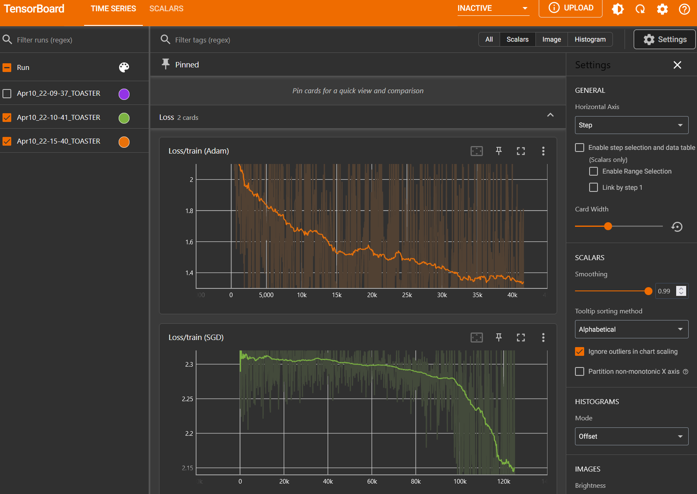
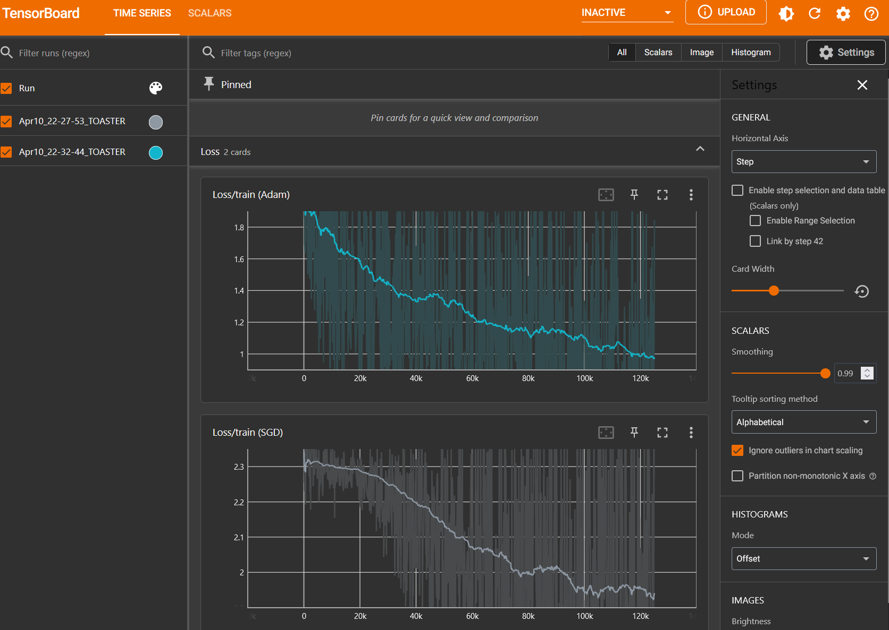

# Advanced Deep Learning (D7047E) - Group23
This is the submission repository for group 23 of the LTU course Advanced Deep Learning (D7047E). The exercises are grouped into directories containing the relevant code files and supplementary material like screenshots.

### Members
Anthony Colton  
Nick Lucas Friesen  
Robert Lindberg  
Sergio Serrano Hernández  
Tim Ufer

## Exercise 1
Here is the `tensorboard` screenshot showing the training loss of the model using LeakyReLU as the activation function:

Here is the `tensorboard` screenshot showing the training loss of the model using Tanh as the activation function:

